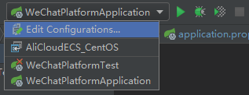
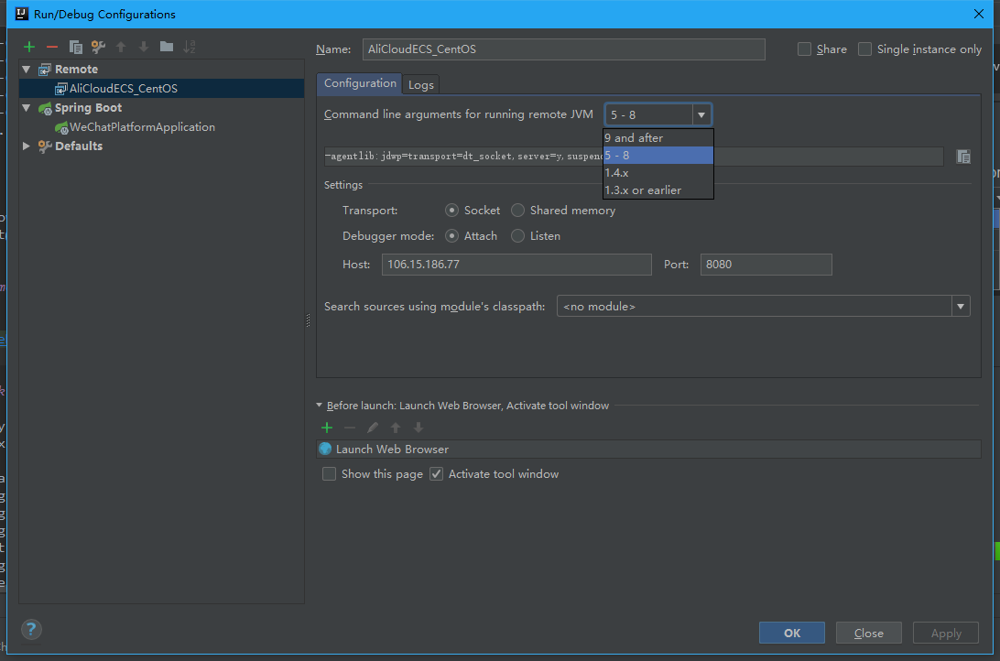
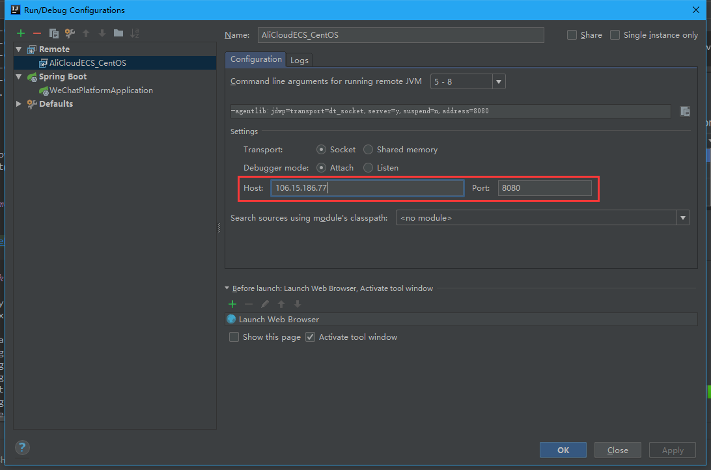
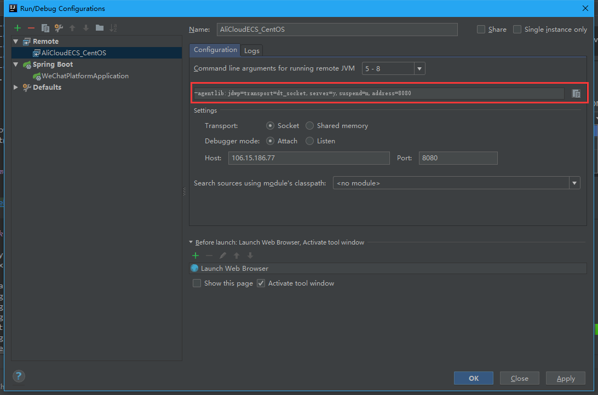
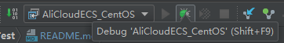
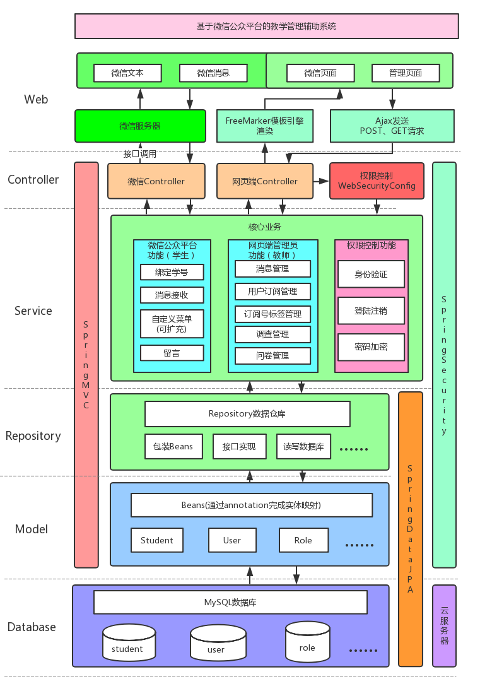

# WeChatPlatformApplication

**WeChatPlatform Application for Graduation Project** (Acceptance of works has been passed on May 9th.)

[](http://www.apache.org/licenses/LICENSE-2.0.html)


## Features

- Simplify work in teaching assistant by using WeChatPlatform.
- Integrate SpringBoot, SpringSecurity, SpringMVC , SpringDataJPA framework to achieve after end of the Web  project.
- Using JQuery, WeUI to achieve front end of the Web project.
- Integrate FastBootWeiXin to achieve the WeChat project.

## How to use

First, this project is deployed outside the network environment because it needs to connect WeChat server. Meanwhile it's too much trouble to configure internal network penetration in the campus network environment. So, choosing the Cloud Server is your best choice.

Here is my run-time environment: 

### RunTimeEnvironment

- AliCloud ECS实例 

  ```reStructuredText
  地域: 华东2
  CPU: 1核
  内存: 1GB(I/O优化)
  带宽: 1Mbps 
  ```

- CentOS ```··~]# lsb_release -a```

  ```powershell
  LSB Version:	core-4.1-amd64:core-4.1-noarch
  Distributor ID:	CentOS
  Description:	CentOS Linux release 7.4.1708 (Core) 
  Release:	7.4.1708
  Codename:	Core
  ```

- Java ```··~]# java -version```

  ```powershell
  java version "1.8.0_131"
  Java(TM) SE Runtime Environment (build 1.8.0_131-b11)
  Java HotSpot(TM) 64-Bit Server VM (build 25.131-b11, mixed mode)
  ```

- Maven ```··~]# mvn -v```

  ```powershell
  Apache Maven 3.5.2
  Maven home: /usr/lib/apache-maven-3.5.2
  Java version: 1.8.0_131, vendor: Oracle Corporation
  Java home: /usr/lib/jdk1.8.0_131/jre
  Default locale: en_US, platform encoding: UTF-8
  OS name: "linux", version: "3.10.0-693.2.2.el7.x86_64", arch: "amd64", family: "unix"
  ```

- MySQL ```··~]# mysql -version```

  ```powershell
  Ver 14.14 Distrib 5.7.21, for Linux (x86_64) using  EditLine wrapper
  (Maybe should try MariaDB first...)
  ```

This dev environment goes with it: 

### DevEnvironment

- Windows  ```··> systeminfo```

  ```bash
  OS 名称:          Microsoft Windows 10 家庭中文版
  OS 版本:          10.0.16299 Build 16299
  OS 制造商:        Microsoft Corporation
  OS 配置:          独立工作站
  ```

- Java  ```··> java -version```

  ```powershell
  java version "1.8.0_162"
  Java(TM) SE Runtime Environment (build 1.8.0_162-b12)
  Java HotSpot(TM) 64-Bit Server VM (build 25.162-b12, mixed mode)
  ```

- Maven  ```··> mvn -v```

  ```bash
  Apache Maven 3.5.2
  Maven home: C:\Program Files (x86)\Apache Software Foundation\apache-maven-3.5.2\bin\..
  Java version: 1.8.0_162, vendor: Oracle Corporation
  Java home: C:\Program Files\Java\jre1.8.0_162
  Default locale: zh_CN, platform encoding: GBK
  OS name: "windows 10", version: "10.0", arch: "amd64", family: "windows"
  ```

- IntelliJ IDEA ``` -> Help -> About```

  ```powershell
  IntelliJ IDEA 2018.1 (Ultimate Edition)
  Build #IU-181.4203.550, built on March 27, 2018
  Licensed to L**(Student Version)
  Subscription is active until September 12, 2018
  JRE: 1.8.0_152-release-1136-b20 amd64
  JVM: OpenJDK 64-Bit Server VM by JetBrains s.r.o
  Windows 10 10.0
  ```

- Typora ``` -> Help -> About``` (For MarkDown)

  ```powershell
  Typora for Windows/Linux
  version 0.9.48(beta)
  ```

  ### 

### Configuration

#### 服务器安全组配置需放通端口：

```shell
Linux SSH登录   
    - 22
- Web服务端口
    - 80, 443
- Windows远程登录
    - 3389
- 调试端口(与idea搭配使用，可自行修改idea中的配置)
    - 8080,
- MySQL监听服务
    - 3306
```

#### 服务器端口配置

###### (HTTP用80，HTTPS用443，本项目用的HTTP)

项目配置文件(src/main/resources/application.properties)

```properties
# IF HTTP
server.port=80
# If HTTPS
server.port=443
```

#### 微信号配置[测试号]：

1. 测试号申请：[链接](https://mp.weixin.qq.com/debug/cgi-bin/sandbox?t=sandbox/login)

2. 申请完成，进入测试号管理页面，记录[测试号信息]中的appID和appsecret用于项目配置文件(src/main/resources/application.properties)

   ```properties
   wx.appid=# Your appID
   wx.appsecret=# Your appsecret
   ```

3. 接口配置信息 修改

   ① URL——http://{Your IP or Domain}/{path}，URL是开发者用来接收微信消息和事件的接口URL。

   ② Token——任意填写，用作生成签名（该Token会和接口URL中包含的Token进行比对，从而验证安全性），对应.properties

   ③ 正式号会有EncodingAESKey，可选择自动生成，本项目没有使用

   ```properties
   wx.path=# Match your {path}
   wx.token=# Your token 
   ```

	详情可查看[《微信公众平台技术文档》—接入指南—填写服务器配置](https://mp.weixin.qq.com/wiki?t=resource/res_main&id=mp1421135319)

4. JS接口安全域名修改(若需使用JS-SDK时才需配置，本项目中未使用，可不做配置)

   域名——http://{Your IP or Domain}/

5. OAuth2.0网页授权[体验接口权限表->网页服务->网页帐号->修改]

   用户在网页授权页同意授权给公众号后，微信会将授权数据传给一个回调页面，回调页面需在此域名下，以确保安全可靠。沙盒号回调地址支持域名和ip，正式公众号回调地址只支持域名。 

   授权回调页面域名——{Your IP or Domain}

   ```properties
   wx.callback-domain=# Your IP address or domain
   # Also can use url:
   wx.callback-url=http://{Your IP address or domain}/
   # oauth2的拦截器配置，默认是/wx/**，可不配置
   wx.mvc.interceptor.includePatterns[0]=/wx/**
   ```

   

#### Run on Server

1. 使用 XShell 6 配置服务器连接，正常连接服务器

   ```powershell
   Connecting to {remoteAddress}:22...
   Connection established.
   To escape to local shell, press 'Ctrl+Alt+]'.
   
   Last login: Wed May 9 09:07:21 2018 from {localAddress}
   
   Welcome to Alibaba Cloud Elastic Compute Service !
   
   [root@xxxxx ~]# 
   ```

2. 配置运行环境，安装Java，略(教程一大堆)

3. 创建工作目录并进入

   ``````powershell
   [root@xxxxx ~]# mkdir test
   [root@xxxxx ~]# cd test
   ``````

4. 传输文件，将本地通过```mvn package```打包的jar包传输到远程服务器，需要安装XShell插件或搭配Xftp使用

   ```powershell
   [root@xxxxx ~]# rz -E
   ```

5. 检查文件

   ```powershell
   [root@xxxxx ~]# ls
   WeChatPlatformApplication-1.0-SNAPSHOT.jar
   ```

6. Run~ That's easy, right?

   ```powershell
   [root@xxxxx ~]# java -jar WeChatPlatformApplication-1.0-SNAPSHOT.jar
   
     .   ____          _            __ _ _
    /\\ / ___'_ __ _ _(_)_ __  __ _ \ \ \ \
   ( ( )\___ | '_ | '_| | '_ \/ _` | \ \ \ \
    \\/  ___)| |_)| | | | | || (_| |  ) ) ) )
     '  |____| .__|_| |_|_| |_\__, | / / / /
    =========|_|==============|___/=/_/_/_/
    :: Spring Boot ::        (v1.5.9.RELEASE)
   
   2018-05-07 15:24:41.729  INFO 15287 --- [           main] wx.test.WeChatPlatformApplication        : Starting WeChatPlatformApplication v1.0-SNAPSHOT on iZuf60h59yfc470p7zcb9fZ with PID 15287 (/root/test/WeChatPlatformApplication-1.0-SNAPSHOT.jar started by root in /root/test)
   2018-05-07 15:24:41.732  INFO 15287 --- [           main] wx.test.WeChatPlatformApplication        : No active profile set, falling back to default profiles: default
   2018-05-07 15:24:41.986  INFO 15287 --- [           main] ationConfigEmbeddedWebApplicationContext : Refreshing org.springframework.boot.context.embedded.AnnotationConfigEmbeddedWebApplicationContext@5f4da5c3: startup date [Mon May 07 15:24:41 CST 2018]; root of context hierarchy
   2018-05-07 15:24:47.398  INFO 15287 --- [           main] s.b.c.e.t.TomcatEmbeddedServletContainer : Tomcat initialized with port(s): 80 (http)
   2018-05-07 15:24:47.425  INFO 15287 --- [           main] o.apache.catalina.core.StandardService   : Starting service [Tomcat]
   2018-05-07 15:24:47.426  INFO 15287 --- [           main] org.apache.catalina.core.StandardEngine  : Starting Servlet Engine: Apache Tomcat/8.5.23
   2018-05-07 15:24:47.672  INFO 15287 --- [ost-startStop-1] o.a.c.c.C.[Tomcat].[localhost].[/]       : Initializing Spring embedded WebApplicationContext
   2018-05-07 15:24:47.672  INFO 15287 --- [ost-startStop-1] o.s.web.context.ContextLoader            : Root WebApplicationContext: initialization completed in 5688 ms
   2018-05-07 15:24:48.187  INFO 15287 --- [ost-startStop-1] o.s.b.w.servlet.FilterRegistrationBean   : Mapping filter: 'characterEncodingFilter' to: [/*]
   .....................
   ```

7. 当然，上面那样关了XShell就停止了，要在后台运行的话需要加nohup &，日志会保存到nohup.out中，可用vim查看

   ```powershell
   [root@xxxxx ~]# nohup java -jar WeChatPlatformApplication-1.0-SNAPSHOT.jar &
   ```

#### Remote Debug

1. Open IDEA, find the Edit Configuration.
  

2. Remote，一开始可能没有Remote配置，新建一个即可

  

3. 选择远端服务器上运行的JVM版本，这里是Java8于是选择5 - 8

   

4. 配置Host和Port，Host是远端服务器的ip，port自定一个端口(需配合安全组的设置，这里用的8080，小心别和Tomcat冲突了)

   

5. 点这串参数右边的复制按钮，然后OK

   

6. 服务器运行命令，等待连接

   java -jar {刚才复制的参数} {jar包名}

   ```powershell
   [root@xxxxx ~]# java -jar -agentlib:jdwp=transport=dt_socket,server=y,suspend=n,address=8080 WeChatPlatformApplication-1.0-SNAPSHOT.jar
   Listening for transport dt_socket at address: 8080
   
     .   ____          _            __ _ _
    /\\ / ___'_ __ _ _(_)_ __  __ _ \ \ \ \
   ( ( )\___ | '_ | '_| | '_ \/ _` | \ \ \ \
    \\/  ___)| |_)| | | | | || (_| |  ) ) ) )
     '  |____| .__|_| |_|_| |_\__, | / / / /
    =========|_|==============|___/=/_/_/_/
    :: Spring Boot ::        (v1.5.9.RELEASE)
   
   2018-05-13 13:26:50.682  INFO 23086 --- [           main] wx.test.WeChatPlatformApplication        : Starting WeChatPlatformApplication v1.0-SNAPSHOT on iZuf60h59yfc470p7zcb9fZ with PID 23086 (/root/test/WeChatPlatformApplication-1.0-SNAPSHOT.jar started by root in /root/test)
   ......
   ```
  

7. Idea里选择刚才的配置，点击"小虫子"进行调试

   

8. Break-Point. Debug it.


## Stack

- JQuery
  - Ajax
- WeUI
- FreeMarker
- Spring Security
- Spring MVC
- Spring Boot
  - FastBootWeiXin { [](http://weixin.mxixm.com)[](http://search.maven.org/#artifactdetails%7Ccom.mxixm%7Cfastboot-weixin%7C0.5.1%7Cjar)[](http://www.apache.org/licenses/LICENSE-2.0.html)[](https://jq.qq.com/?_wv=1027&k=5iRu13U)}
- Spring Data JPA
  - Hibernate
- MySQL
- Maven

## Introduction

SystemStructureDiagram:

[](./Wiki/SystemStructureDiagram.png)

emmmm, I think this diagram is enough to describe this system.

## Special thanks & Credits

- [HikariShine](https://github.com/HikariShine): Thank you so much for the guide of [FastBootWeiXin](https://github.com/FastBootWeixin/FastBootWeixin), which was the core of this project. (However, this shows how much we need interface documentation, lol)
- YangQF: My master of dissertation, this idea comes from our chatting, and thanks for your help in preparing this project, which couldn't be possible to achieve this degree now without you.
- DinL: Thanks a lot for plenty of things in this road specially about a few months' instructions on writing resumes.
- HuoMM: Thanks for advices of acceptance and thesis, it's time to separate technology from theory. (And thanks for the first Star QwQ)

## Reference

- [registration-login-spring-hsql](https://hellokoding.com/registration-and-login-example-with-spring-security-spring-boot-spring-data-jpa-hsql-jsp/)
- [FastBootWeiXin](https://github.com/FastBootWeixin/FastBootWeixin)
- [WeUI](https://github.com/Tencent/weui)
- [WeChatPlatform](https://mp.weixin.qq.com/)
- [How-To-Ask-Questions-The-Smart-Way](https://github.com/ryanhanwu/How-To-Ask-Questions-The-Smart-Way/blob/master/README-zh_CN.md)
- [how_to_choose_free_software_licenses](http://www.ruanyifeng.com/blog/2011/05/how_to_choose_free_software_licenses.html)